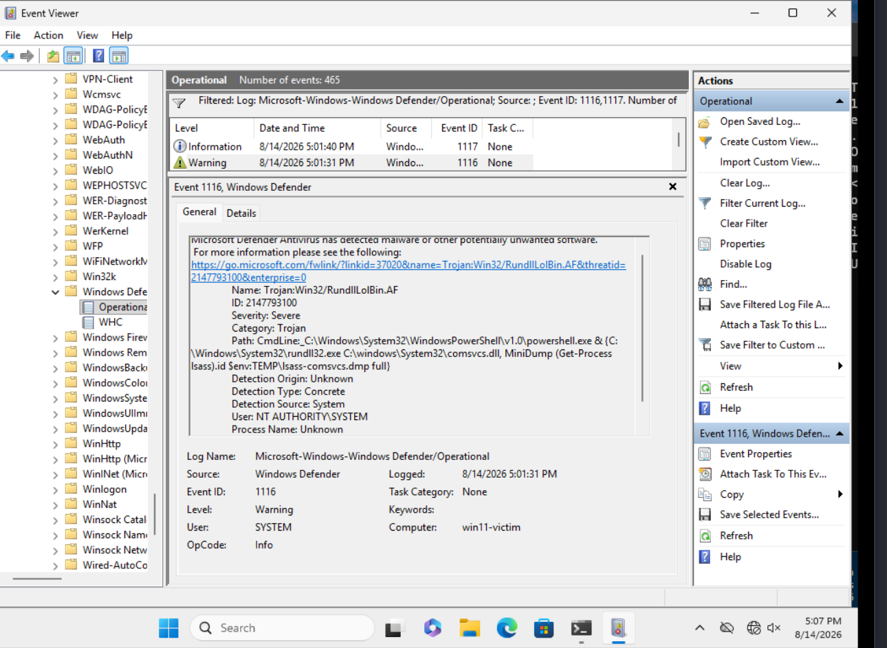
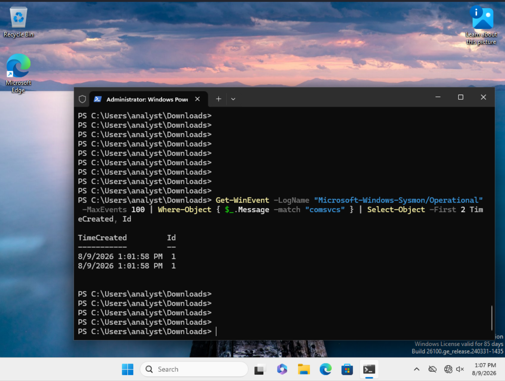

# T1003.001 — LSASS Memory (comsvcs) — Prevented, Then Telemetry Gap

Back to [findings overview](README.md).

## Result: Prevented by Defender, then a telemetry gap with Defender off

Test 2 dumps LSASS memory using `comsvcs.dll` via `rundll32` — a living-off-the-
land technique using signed, built-in Windows components, requiring no external
download.

**With Defender enabled (default state):** the attempt was blocked at process
start with `Exception calling "Start"... Access is denied` in the PowerShell
console. Windows Defender operational log recorded EID 1116 (malware detected)
and 1117 (action taken) at the time of execution, naming the detection
**`Trojan:Win32/RundllLolBin.AF`** and logging the full offending command line —
`rundll32.exe C:\windows\System32\comsvcs.dll, MiniDump (Get-Process lsass).id
$env:TEMP\lsass-comsvcs.dmp full`. No LSASS handle was opened. Real-time
protection was on; ASR rules were not configured, so the block came from
signature-based antivirus rather than an Attack Surface Reduction rule. On a
protected endpoint, the endpoint's own AV is the effective control here.

**With Defender disabled (to test the detection layer):** the dump executed
successfully (exit code 0). Sysmon logged the `rundll32`/`comsvcs` process
creation (EID 1) but produced **no EID 10 (ProcessAccess)** for the handle
opened against `lsass.exe`. Nothing reached Wazuh to alert on.

The cause is the Sysmon configuration. The SwiftOnSecurity `sysmonconfig` filters
ProcessAccess events heavily by default, because unfiltered EID 10 is extremely
high volume. LSASS access is not among the logged cases. This is a **telemetry
gap**, not a rule gap: no rule can detect what the sensor is not recording.

## Lab 2 candidate

Add a targeted Sysmon ProcessAccess rule for `lsass.exe` — matching source
images such as `rundll32.exe` and `procdump.exe` and the characteristic
`GrantedAccess` masks (`0x1010`, `0x1410`) used to read process memory. This is
the standard high-value LSASS-dumping detection and cannot exist until EID 10
logging is enabled for the target.

This technique is the clearest illustration of the project's central point:
telemetry must be verified, not assumed. The endpoint blocked the attack, and
when that block was removed the attack succeeded silently — detection failed at
the sensor layer, before any rule was even relevant.
