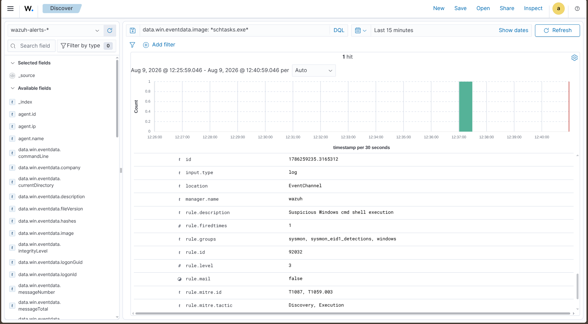

# T1053.005 — Scheduled Task — Rule Gap

Back to [findings overview](README.md).

## Result: Rule gap

Test 2 created a scheduled task named `spawn` with `schtasks.exe /create`. No
rule mapped to T1053.005 fired.

The `schtasks.exe` process itself reached the indexer with its full command line
(Sysmon EID 1 / Security 4688), so the telemetry is present — the gap is that
the default ruleset does not treat scheduled-task creation as noteworthy. This
is a **rule gap**: the data exists, no rule acts on it.

## Data-source note

A rule matching `schtasks.exe` with `/create` would be brittle — tests 4 and 6
in this technique create tasks through the PowerShell `ScheduledTasks` cmdlets
and through WMI, neither of which spawns `schtasks.exe`. The robust source is
Windows EID 4698 (a scheduled task was registered), which fires regardless of
the creation method and carries the task definition.

## Lab 2 candidate

Rule on Windows EID 4698 — method-agnostic, unlike matching the `schtasks.exe`
binary.
