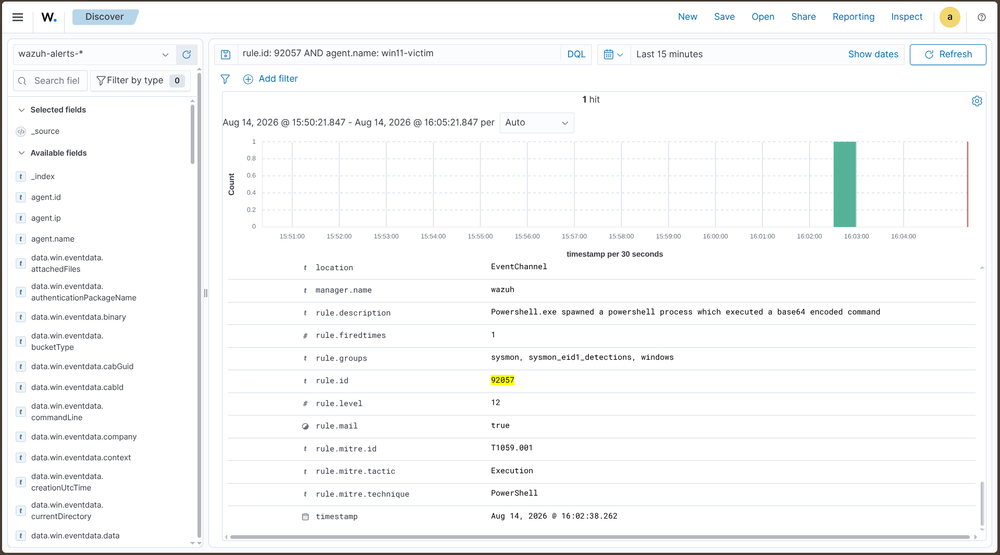
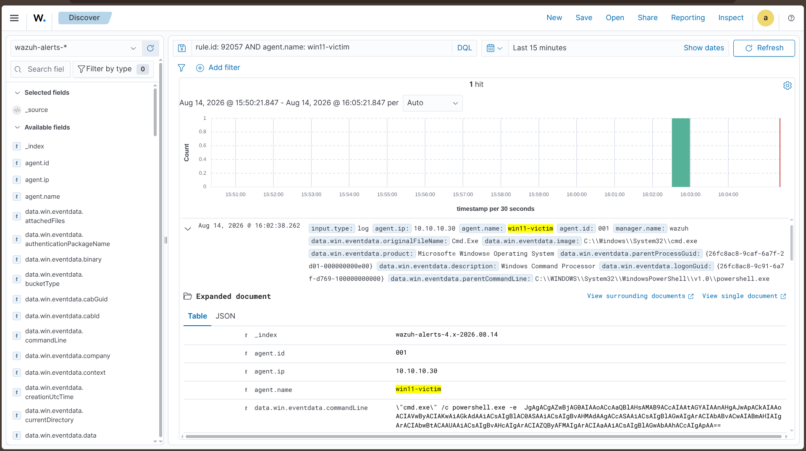

# T1059.001 — PowerShell (Encoded Command) — Detected

Back to [findings overview](README.md).

## Result: Detected out of the box

Test 17 executed an encoded PowerShell command. Two rules fired:

- **Rule 92057, level 12:** "Powershell.exe spawned a powershell process which
  executed a base64 encoded command." High severity, flagged for email. Fires on
  Sysmon EID 1, matching the `-e` / `-EncodedCommand` string in the command line
  combined with the powershell-spawning-powershell parent-child chain.
- **Rule 92027, level 4:** "Powershell process spawned powershell instance." A
  generic low-severity behavioural rule.

## Evasion note

The high-severity rule depends on the literal encoded-command flag appearing in
the command line. An attacker using `-Command` with inline obfuscation, or a
download cradle, avoids that string and trips only the level-4 rule, which is
too noisy to be actioned. The detection is therefore string-dependent. A more
durable rule would key on PowerShell script block content (EID 4104), which
records the decoded payload regardless of how it was invoked — a candidate for
Lab 2.

## Lab 2 candidate

Rule on 4104 script-block content — invocation-independent, unlike a
command-line-string match.
