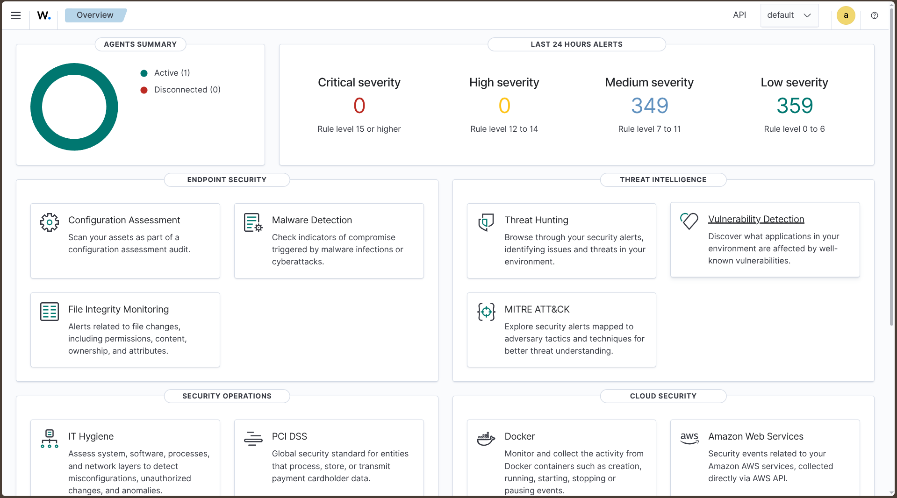
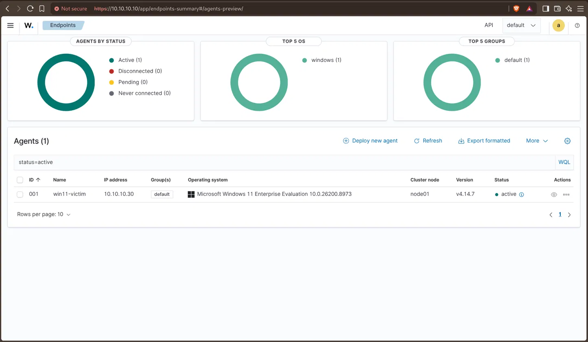
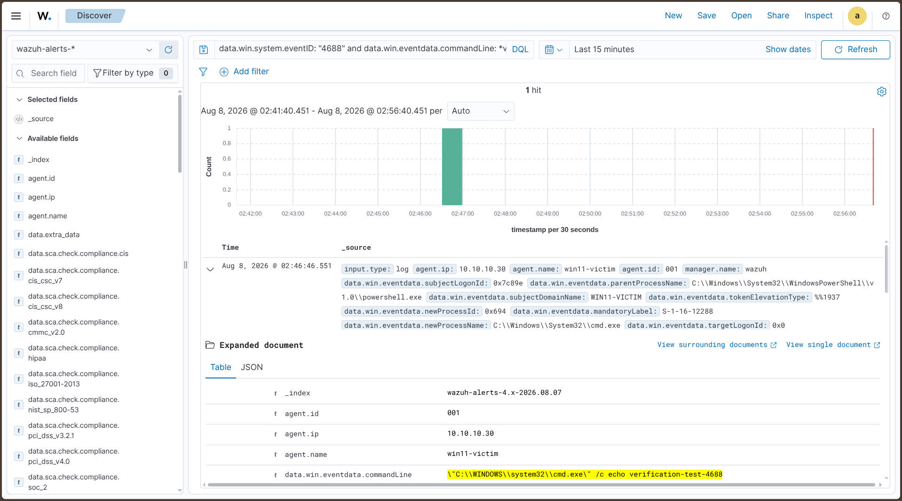
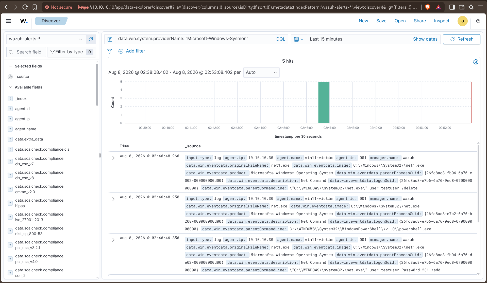
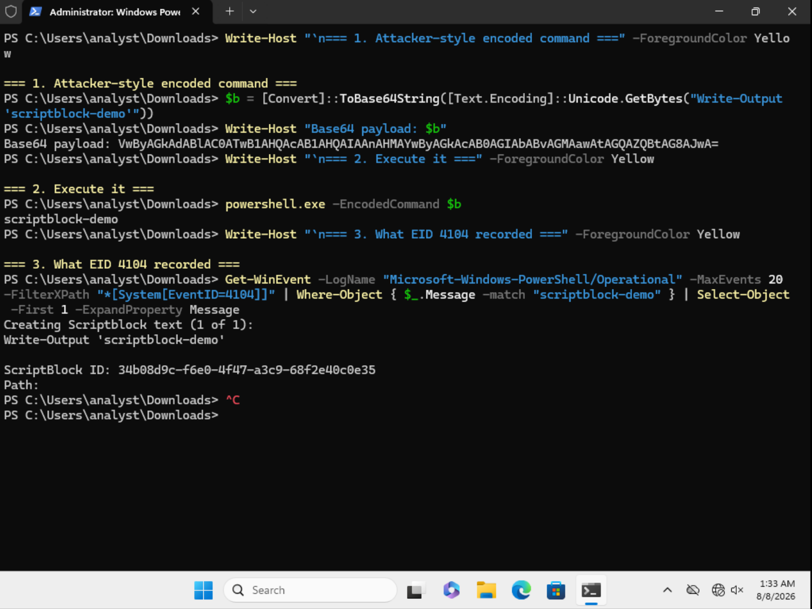
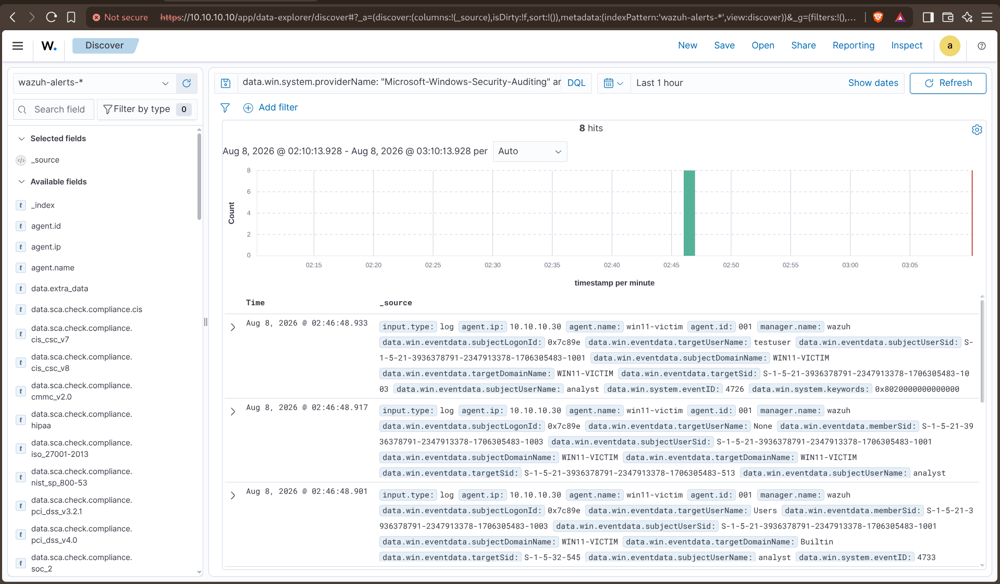

# Setup — Endpoint & Telemetry

Back to [Lab 1 overview](../README.md). Previous: [SIEM build](01-siem-build.md).

## Endpoint: Windows 11 victim

| Property | Value |
| --- | --- |
| OS | Windows 11 Enterprise Evaluation, 25H2 (build 26200.8973) |
| Address | `10.10.10.30/24`, no gateway |
| Resources | 4 GB RAM, 60 GB disk, 2 vCPU |
| Machine type | q35, UEFI (OVMF), emulated TPM 2.0 via swtpm |
| Local account | `analyst` (no Microsoft account) |
| Wazuh agent | 4.14.7-1, enrolled as `win11-victim`, agent ID 001 |

Windows 11 enforces UEFI and TPM 2.0 at install time, so the guest needed the
q35 chipset, OVMF firmware, and a `swtpm` emulated TPM rather than QEMU's
defaults. The system disk is on the virtio bus for throughput, which means
Windows setup cannot see it until the virtio storage driver is loaded manually
from a second CD (`viostor\w11\amd64`). Both ISOs are attached over SATA
precisely because the installer cannot boot from a bus it has no driver for.

The endpoint was patched to current over a temporary NAT interface, which was
then detached with `--persistent`. Verification from the endpoint afterwards:

    C:\> ping -n 2 8.8.8.8
    PING: transmit failed. General failure.

All subsequent software — Sysmon, its configuration, and the Wazuh agent — was
delivered from the Kali host over HTTP (`10.10.10.1:8000`), bound explicitly to
the lab bridge rather than all interfaces. This mirrors how an air-gapped
endpoint is actually serviced, and each transfer generates Sysmon EID 3 network
telemetry as a side effect.

## Telemetry configuration

Default Windows logging is insufficient for behavioural detection. The
configuration below was applied and each setting verified to produce events
before moving on.

### Baseline audit policy

The default policy on this build was measured before changing anything:

| Subcategory | Default state |
| --- | --- |
| Logon | Success and Failure |
| Special Logon | Success |
| User Account Management | Success |
| **Process Creation** | **No Auditing** |

Windows 11 25H2 ships with more auditing enabled than much of the available
guidance assumes. Logon and account-management auditing were already on; the
only gap was process creation.

### Applied configuration

    auditpol /set /subcategory:"Process Creation" /success:enable

Command-line capture in EID 4688, without which the event records that a process
started but not what it was asked to do:

    HKLM\SOFTWARE\Microsoft\Windows\CurrentVersion\Policies\System\Audit
      ProcessCreationIncludeCmdLine_Enabled = 1 (DWORD)

PowerShell script block logging (EID 4104):

    HKLM\SOFTWARE\Policies\Microsoft\Windows\PowerShell\ScriptBlockLogging
      EnableScriptBlockLogging = 1 (DWORD)

Sysmon was installed with the SwiftOnSecurity community configuration rather
than a hand-written one:

    .\Sysmon64.exe -accepteula -i sysmonconfig.xml

The command-line interface was used throughout in preference to the Group Policy
editor so that the configuration is reproducible and can be verified from a
transcript.

### Why script block logging matters

Command-line logging alone is defeated by encoding. Script block logging hooks
the PowerShell engine and records each block after deobfuscation, immediately
before execution. Demonstrated directly:

    PS> $b = [Convert]::ToBase64String([Text.Encoding]::Unicode.GetBytes("Write-Output 'scriptblock-demo'"))
    PS> powershell.exe -EncodedCommand $b

The command line visible to EID 4688 is an opaque base64 string. EID 4104
recorded:

    Creating Scriptblock text (1 of 1):
    Write-Output 'scriptblock-demo'

A detection keyed on the command line sees the blob; one keyed on 4104 sees the
code.

### Sysmon EID 1 versus Security EID 4688

Both record process creation. Sysmon additionally provides MD5, SHA256 and
IMPHASH of the image; the parent's full command line, where 4688 gives only the
parent's name; a `ProcessGuid` that is globally unique and therefore immune to
PID reuse; signature metadata including `OriginalFileName`, which survives
renaming of the binary; and a dedicated log channel that is not competing for
retention with Security log volume.

4688's advantages are that it is native, requires no third-party kernel driver,
and is available on endpoints where installing software is not an option.

## Agent configuration

The agent was installed and enrolled in one step:

    msiexec.exe /i wazuh-agent.msi /q WAZUH_MANAGER="10.10.10.10" WAZUH_AGENT_NAME="win11-victim"

The default `ossec.conf` collects four sources:

    Application
    Security
    System
    active-response\active-responses.log

Sysmon and PowerShell write to their own event channels and are not collected
unless declared. Two `<localfile>` blocks were added:

    <localfile>
      <location>Microsoft-Windows-Sysmon/Operational</location>
      <log_format>eventchannel</log_format>
    </localfile>

    <localfile>
      <location>Microsoft-Windows-PowerShell/Operational</location>
      <log_format>eventchannel</log_format>
    </localfile>

## Verification: telemetry sources checked independently

Agent status is not evidence that data is arriving. Each source was verified
separately by generating a known event on the endpoint and locating it in the
indexer.

| Source | Reaches indexer | Alerts on default ruleset |
| --- | --- | --- |
| Sysmon EID 1 (process create) | Yes | Yes |
| Security 4688 with command line | Yes | Yes |
| Security 4720 / 4722 / 4726 (account management) | Yes | Yes |
| PowerShell 4104 (script block) | Yes | Only on suspicious content |
| Security 4624 (successful logon) | Yes | **No** |

Three findings came out of this that shape the Lab 2 coverage work.

**The distinction between a telemetry gap and a rule gap.** `wazuh-alerts-*`
contains only events that matched a rule. An empty query result therefore has
two possible causes, and they call for opposite remedies — reconfiguring
collection, or writing a detection. Querying by `providerName` rather than
`eventID` separates them: if the provider returns hits, the channel is being
collected and the gap is in the ruleset.

**4104 arrives but rarely alerts.** Benign script blocks are ingested,
evaluated, and dropped. The only 4104 alerts present in a one-day window came
from the agent's own SCA policy checks, which invoke `secedit`. A manually
generated benign script block produced no alert. Detection of PowerShell
execution therefore depends on rule content, not on collection.

**4624 does not alert at all on the default ruleset.** Over a 24-day window no
successful-logon event produced an alert, while the same Security channel
delivered 72 EID 4688 events in a single hour. This is a defensible default —
4624 volume is very high on any real endpoint — but it means out-of-box coverage
for logon-based techniques is zero.

**Account management events do alert, contrary to the assumption this lab
started with.** Creating and deleting a local account produced eight alerts
including EID 4720 and 4722, carrying `samAccountName`, `targetUserName`, and
the initiating `subjectUserName`. This was expected to be a blind spot requiring
a custom rule; measurement showed otherwise on this version with account
management auditing already enabled by default. The assumption was carried into
the lab from secondary sources and did not survive testing.

## Issues encountered

One issue from this phase is kept here because it is the clearest illustration
of the project's central point: agent health is not evidence data is arriving.
The rest — duplicated config, guest tooling, and the licence watermark — are in
[troubleshooting.md](troubleshooting.md).

### Two telemetry sources silently absent from the agent configuration

**Symptom.** The agent enrolled, showed Active, and delivered Security log
events. Sysmon and PowerShell events, verified as present on the endpoint,
produced nothing in the indexer.

**Cause.** The default Windows `ossec.conf` collects Application, Security, and
System only. Sysmon and PowerShell write to separate event channels that must be
declared explicitly.

**Impact.** Two of four intended sources were being generated on the endpoint
and discarded. Nothing in the agent status, the service state, or the agent log
indicated a problem.

**Takeaway.** Agent health and data arrival are independent. Every source needs
an end-to-end test — generate a known event, then find that specific event in
the indexer.

## Endpoint snapshot

| Name | State captured |
|---|---|
| `clean-baseline` | Windows 11 patched, Sysmon, audit policy, script block logging, agent enrolled, all four sources verified |

Taken from a clean shutdown. Every attack simulation reverts to this point
first, so that detections fire on the technique under test rather than on
residue from an earlier run.

---

Next: [Atomic Red Team findings](../findings/README.md).
